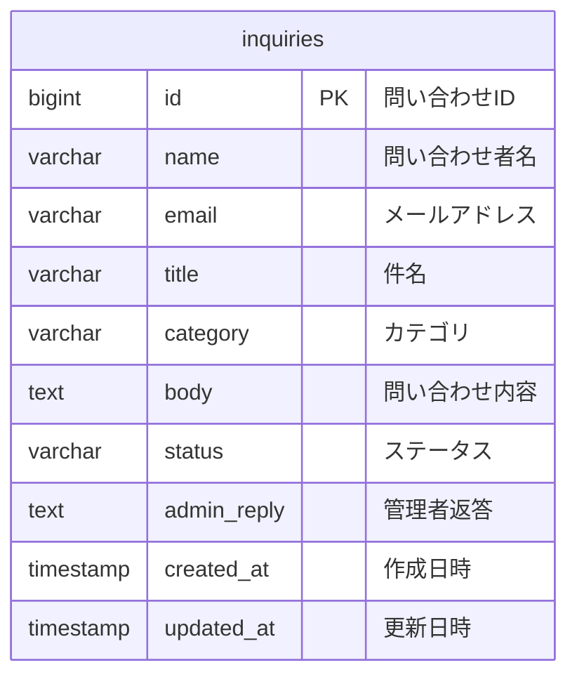

# 問い合わせ管理Demoサイト 設計メモ

## 1. この資料の目的

この資料は、問い合わせ管理Demoサイトを **Laravel + DB構成へ拡張する前段階の設計メモ** です。

現在は、HTML / CSS / JavaScript / localStorage による静的Demoとして作成しています。  
次の段階では、Laravel と SQLite または MySQL を使用し、問い合わせデータをDBで管理する構成へ変更します。

---

## 2. 現在の構成

### 静的Demo版

```text
利用者
↓
問い合わせフォーム
↓
JavaScript
↓
localStorage
↓
管理者一覧・詳細画面
```

### Laravel + DB版

```text
利用者
↓
問い合わせフォーム
↓
Laravel Controller
↓
DB
↓
管理者一覧・詳細画面
```

現在の `localStorage` 保存を、DB保存に置き換えることが主な目的です。

---

## 3. 画面構成

| 画面 | 現在の静的Demo | Laravel化後 |
|---|---|---|
| 問い合わせフォーム | `index.html` | `resources/views/inquiries/create.blade.php` |
| 管理者一覧 | `pages/admin-list.html` | `resources/views/admin/inquiries/index.blade.php` |
| 管理者詳細 | `pages/admin-detail.html` | `resources/views/admin/inquiries/show.blade.php` |

---

## 4. URL設計

| URL | メソッド | 処理 | Controller |
|---|---:|---|---|
| `/` | GET | 問い合わせフォーム表示 | `InquiryController@create` |
| `/inquiries` | POST | 問い合わせ登録 | `InquiryController@store` |
| `/admin/inquiries` | GET | 管理者一覧表示 | `InquiryController@index` |
| `/admin/inquiries/{inquiry}` | GET | 問い合わせ詳細表示 | `InquiryController@show` |
| `/admin/inquiries/{inquiry}` | PUT | ステータス・返答更新 | `InquiryController@update` |
| `/admin/inquiries/{inquiry}` | DELETE | 問い合わせ削除 | `InquiryController@destroy` |

---

## 5. DB設計方針

初期段階では、問い合わせ本体を管理する `inquiries` テーブル1つで構成します。

まずは以下の機能を優先します。

- 問い合わせ登録
- 問い合わせ一覧表示
- 問い合わせ詳細表示
- ステータス変更
- 管理者返答保存
- 削除

操作ログ、複数返答履歴、担当者管理などは、後から別テーブルとして追加する想定です。

---

## 6. ER図

初期段階では `inquiries` テーブルのみです。



---

## 7. inquiries テーブル定義

| カラム名 | 型 | 必須 | 内容 |
|---|---|---:|---|
| `id` | bigint | ○ | 問い合わせID |
| `name` | string(50) | ○ | 問い合わせ者名 |
| `email` | string | ○ | メールアドレス |
| `title` | string(100) | ○ | 件名 |
| `category` | string(20) | ○ | カテゴリ |
| `body` | text | ○ | 問い合わせ内容 |
| `status` | string(20) | ○ | 対応状況 |
| `admin_reply` | text | - | 管理者返答 |
| `created_at` | timestamp | ○ | 作成日時 |
| `updated_at` | timestamp | ○ | 更新日時 |

---

## 8. ステータス設計

| ステータス | 意味 |
|---|---|
| 未対応 | まだ管理者が対応していない状態 |
| 対応中 | 管理者が確認・対応している状態 |
| 回答済み | 利用者への返答が完了した状態 |
| クローズ | 対応完了として終了した状態 |

初期登録時のステータスは `未対応` とします。

---

## 9. バリデーション設計

Laravel側では、DB保存前に以下のバリデーションを行います。

| 項目 | ルール |
|---|---|
| `name` | 必須、文字列、50文字以内 |
| `email` | 必須、メール形式、255文字以内 |
| `title` | 必須、文字列、100文字以内 |
| `category` | 必須、文字列、20文字以内 |
| `body` | 必須、文字列、1000文字以内 |
| `status` | 必須、文字列、20文字以内 |
| `admin_reply` | 任意、文字列、1000文字以内 |

フロント側入力チェックは、利用者の入力補助として実装済みです。  
Laravel側では、DB保存前の本命のチェックとしてサーバー側バリデーションを実装します。

---

## 10. Laravelの構成

| ファイル | 役割 |
|---|---|
| `routes/web.php` | URLとControllerの紐づけ |
| `app/Models/Inquiry.php` | `inquiries` テーブルを扱うModel |
| `app/Http/Controllers/InquiryController.php` | 登録・一覧・詳細・更新・削除の処理 |
| `database/migrations/...create_inquiries_table.php` | `inquiries` テーブルの設計 |
| `resources/views/inquiries/create.blade.php` | 問い合わせフォーム |
| `resources/views/admin/inquiries/index.blade.php` | 管理者一覧 |
| `resources/views/admin/inquiries/show.blade.php` | 管理者詳細 |

---

## 11. 処理フロー

### 問い合わせ登録

```text
問い合わせフォーム入力
↓
POST /inquiries
↓
InquiryController@store
↓
バリデーション
↓
inquiries テーブルへ保存
↓
管理者一覧へリダイレクト
```

### 管理者一覧表示

```text
GET /admin/inquiries
↓
InquiryController@index
↓
inquiries テーブルからデータ取得
↓
一覧画面に表示
```

### ステータス・返答更新

```text
管理者詳細画面でステータス・返答を入力
↓
PUT /admin/inquiries/{inquiry}
↓
InquiryController@update
↓
バリデーション
↓
対象問い合わせを更新
↓
管理者一覧へリダイレクト
```

---

## 12. 後から追加予定の設計

初期段階では `inquiries` テーブルのみで進めますが、将来的には以下のテーブル追加を想定します。

### inquiry_logs

操作履歴を管理するテーブルです。

| カラム | 内容 |
|---|---|
| `id` | ログID |
| `inquiry_id` | 問い合わせID |
| `action` | 操作内容 |
| `before_value` | 変更前 |
| `after_value` | 変更後 |
| `operated_by` | 操作者 |
| `created_at` | 操作日時 |

### inquiry_replies

複数回の返答履歴を管理する場合に追加します。

| カラム | 内容 |
|---|---|
| `id` | 返答ID |
| `inquiry_id` | 問い合わせID |
| `reply_body` | 返答内容 |
| `created_at` | 返答日時 |

---

## 13. 初期実装の範囲

今回のLaravel化で最初に対応する範囲は以下です。

- `inquiries` テーブル作成
- `Inquiry` Model作成
- `InquiryController` 作成
- 問い合わせ登録画面作成
- 問い合わせ登録処理
- 管理者一覧画面作成
- 管理者詳細画面作成
- ステータス・返答更新処理
- 削除処理

ログ管理、管理者認証、メール送信、返答履歴の別テーブル化は後続対応とします。
